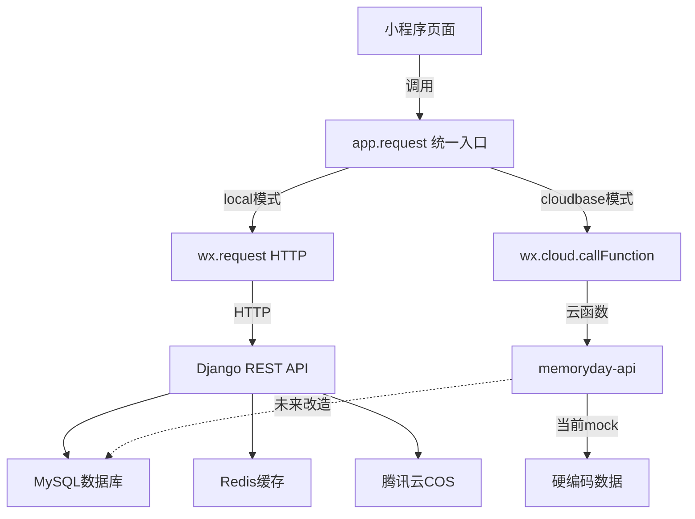

## 产品概述

"今日吃啥"是一款微信小程序个人菜谱管理应用，核心功能包括菜品管理、随机选菜、饮食统计和COS图片存储。项目后端API和数据模型已完善，前端UI框架已搭建，但前后端数据链路完全断裂，所有页面使用mock数据运行。

## 核心功能

- 将前端7个页面的数据获取从mock切换到真实API调用
- 实现微信登录流程（后端新增微信登录端点 + 前端对接wx.login）
- 修复代码缺陷（process.env、COS model引用、deployment页面注册）
- 注册deployment页面到app.json使其可访问
- 修复cosService.js和environment.js中process.env不可用的问题
- 修复后端cos/models.py中User引用错误

## 技术栈

- 前端：微信小程序原生框架（WXML + WXSS + JavaScript）
- 后端：Django 4.2 + Django REST Framework + SimpleJWT
- 数据库：MySQL 8.0
- 缓存：Redis 7
- 云服务：腾讯云COS（对象存储）、腾讯云CloudBase（云函数）
- 认证：JWT + 微信OpenID登录

## 实现方案

### 核心策略：统一API调用层

项目已有 `app.request()` 方法（在app.js中），支持根据deploymentMode自动切换HTTP请求/云函数调用。但各页面未使用此方法，而是直接写死mock数据。关键决策是**统一使用 `app.request()` 而非 `utils/api.js` 中的ApiClient**，因为：

1. `app.request()` 已集成部署模式切换逻辑（local/cloudbase自动适配）
2. `app.request()` 已集成性能监控和401自动登出
3. `utils/api.js` 的ApiClient是独立封装，绕过了部署模式切换机制

### 认证方案

- 后端User模型已支持 `openid` 字段（USERNAME_FIELD='phone'，phone可为空需调整）
- 新增 `/api/auth/wechat-login/` 端点：接收wx.login的code，后端调用微信API换取openid，查找或创建用户，返回JWT
- 前端登录页：wx.login获取code -> 调用后端wechat-login端点 -> 获取JWT -> 存储token和用户信息

### 数据字段映射

后端Dish模型字段与前端mock数据字段存在差异，需要映射：

- 后端 `cooking_time`(int分钟) <-> 前端 `cookingTime`("15分钟"字符串)
- 后端 `difficulty`(easy/medium/hard) <-> 前端 `difficulty`("简单"/"中等"/"复杂")
- 后端 `cuisine_type`(chinese/western等) <-> 前端 `cuisineType`("家常菜"/"川菜"等)
- 后端 `author` <-> 前端不需要
- 后端使用UUID主键 <-> 前端mock使用int

在API调用层做字段转换适配。

## 实现注意事项

- `utils/api.js` 中ApiClient的baseURL在模块加载时固定为 `app.globalData.baseUrl`，如果用户切换部署模式，baseURL不会更新。应优先使用 `app.request()` 方法
- `config/env.js` 正确使用 `__wxConfig` 判断环境，`config/environment.js` 错误使用 `process.env`，需对齐
- 后端DishViewSet的 `perform_create` 使用 `user=self.request.user`，但Dish模型字段名是 `author`，需确认serializer是否处理了此映射
- 微信登录需要后端能调用微信API（AppID + AppSecret），需在.env中配置WECHAT_SECRET
- 后端 `apps/cos/models.py` 第2行引用 `from django.contrib.auth.models import User`，应改为 `from apps.users.models import User`

## 架构设计



## 目录结构

```
c:\Users\ming_\Desktop\memoryday\
├── app.js                          # [MODIFY] 已有request方法，无需大改
├── app.json                        # [MODIFY] 注册deployment页面
├── pages/
│   ├── index/index.js              # [MODIFY] loadDishes()改为调用app.request
│   ├── dish-detail/dish-detail.js  # [MODIFY] loadDishDetail()改为调用app.request
│   ├── dish-edit/dish-edit.js      # [MODIFY] saveDish()改为调用app.request
│   ├── login/login.js              # [MODIFY] 实现真实微信登录流程
│   ├── statistics/statistics.js    # [MODIFY] loadStatistics()改为调用app.request
│   ├── user/user.js                # [MODIFY] loadUserStats()改为调用app.request
│   └── settings/settings.js        # [MODIFY] 部分功能对接API
├── config/
│   └── environment.js              # [MODIFY] 移除process.env，改用env.js方式
├── services/
│   └── cosService.js               # [MODIFY] 移除process.env降级方案
├── backend/
│   ├── apps/users/
│   │   ├── views.py                # [MODIFY] 新增wechat_login视图
│   │   ├── urls.py                 # [MODIFY] 新增wechat-login路由
│   │   └── serializers.py          # [MODIFY] 新增微信登录序列化器
│   └── apps/cos/
│       └── models.py               # [MODIFY] 修复User引用
└── utils/
    └── api.js                      # [KEEP] 保留但页面不直接使用，逐步迁移
```

## Skill

- **miniprogram-development**: 微信小程序开发规则，用于确保微信登录流程和API调用符合小程序平台规范
- Purpose: 指导wx.login集成和小程序端API调用的正确实现
- Expected outcome: 微信登录流程和页面API调用符合微信小程序最佳实践

- **auth-wechat-miniprogram**: 微信小程序CloudBase认证指南
- Purpose: 参考微信小程序认证方案，确保登录流程设计合理
- Expected outcome: 微信登录端点设计正确，OpenID获取和用户创建流程完整